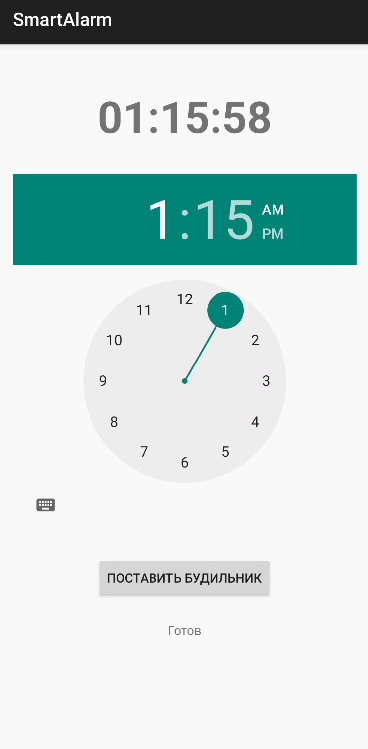

# SmartAlarm — Умный будильник с акселерометром

## Описание
Приложение-будильник, который нельзя выключить просто нажав кнопку. 
Он требует **10 встряхиваний телефона** для выключения.


---

## Возможности

| Функция | Описание |
|---------|----------|
| ⏰ Установка времени | TimePicker для выбора часа и минуты |
| 📳 Виброотклик | При каждом встряхивании телефон вибрирует |
| 🔟 Счётчик трясок | Отображает прогресс (1/10, 2/10...) |
| 🔴 Красный экран | Привлекает внимание при срабатывании |
| 📱 Работает при блокировке | Экран включается даже если телефон заблокирован |
| 🚫 Кнопка «Назад» заблокирована | Нельзя случайно выключить |
| 🔁 Бесконечный звук | Звучит до тех пор, пока не выключат |

---

## Технологии

| Компонент | Технология |
|-----------|------------|
| Язык | Kotlin |
| Датчик | Акселерометр (SensorManager) |
| Будильник | AlarmManager + BroadcastReceiver |
| Звук | MediaPlayer, Foreground Service |
| Вибрация | Vibrator |

---

## Архитектура приложения


---

## Установка и запуск

### Требования
- Android Studio Hedgehog | 2023.1.1+
- Android SDK 26+
- Устройство с Android 8.0+ или эмулятор

### Шаги для запуска

1. **Клонируй репозиторий:**
   ```bash
   git clone https://github.com/ТВОЙ_НИК/SmartAlarm.git
Открой проект в Android Studio:

File → Open → выбери папку проекта

Подключи устройство или запусти эмулятор:

Включи отладку по USB на телефоне

Или создай эмулятор с API 26+ (Android 8.0)

Нажми Run ▶️

Использование
1. Установка будильника
Выбери время на TimePicker

Нажми кнопку "Установить будильник"

2. Когда будильник сработает
Откроется красный экран

Появится счётчик: 0 / 10

Заиграет звук и начнётся вибрация

3. Как выключить
Тряси телефон 10 раз

При каждом встряхивании счётчик увеличивается и телефон вибрирует

После 10 трясок будильник выключится

4. Альтернативное выключение
Кнопка "ВЫКЛЮЧИТЬ" на экране — ручное отключение

## Скриншоты

| Главный экран | Экран будильника |
|---------------|------------------|
|  |  |


Технические параметры
Параметр	Значение	Описание
shakeThreshold	15f	Порог чувствительности акселерометра
requiredShakes	10	Количество трясок для выключения
shakeCooldownMs	500	Задержка между трясками (мс)

Тестирование
Сценарий	Результат
Установка будильника	✅ Успех

Срабатывание в назначенное время	✅ Успех

1-9 встряхиваний	✅ Счётчик увеличивается

10 встряхиваний	✅ Будильник выключен

Кнопка «Назад»	✅ Заблокирована

Работа при заблокированном экране	✅ Экран включается

Вибрация при тряске	✅ Работает


Решение проблем

Проблема	Решение

Акселерометр не работает	Проверь, что датчик есть в телефоне

Нет вибрации	Добавь разрешение VIBRATE в манифест

Будильник не сработал	Не выключай телефон полностью

Звук не играет	Проверь громкость и разрешения


Авторы
Валишин М.М. — разработка

Хабиров Э.И. — отчёт

Группа
ИБ-206Б

Преподаватель
Чернышев Е.С.
